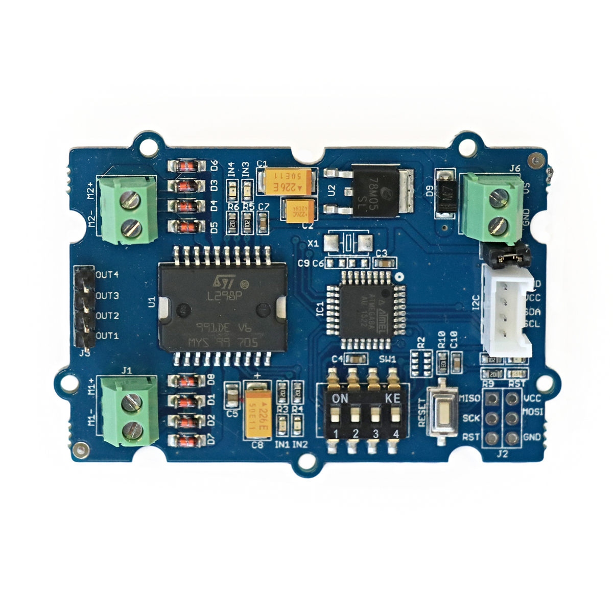

# Motortreiber

## Beschreibung
Im Allgemeinen reichen die Stromstärken, die ein Mikrocontroller liefern kann, nicht aus, um einen Motor direkt anzusteuern. Deshalb gibt es unterschiedliche Arten von sogenannten Motortreibern. Diese werden eingangsseitig am Mikrocontroller und ausgangsseitig am Motor angeschlossen. Sie übersetzen die Kommandos des Mikrocontrollers in die vom Motor benötigten Stromstärken. Gleichzeitig wird der Mikrocontroller von etwaigen Kurzschlüssen oder Überspannungen, die seitens des Motors entstehen könnten, geschützt.

Die vorliegende Ausführung kann einen vieradrigen Schrittmotoroder bis zu zwei Gleichstrommotorenansteuern. Falls zwei Gleichstrommotoren angeschlossen werden, können diese unabhängig voneinander sowohl bezüglich der Richtung und Geschwindigkeit gesteuert werden.

Der Motortreiber wird direkt oder mithilfe des Grove Shields an einen Arduino oder Raspberry Pi über die serielle Schnittstelle I2C  angeschlossen. Der Treiber benötigt dabei eine separate Stromversorgung zwischen 6V und 15V.

Ein Beispielprojekt könnte ein Roboter sein, der ein frei drehbares und zwei angetriebene Räder besitzt. Die zwei Räder können mithilfe des Motortreibers sowohl vorwärts als auch rückwärts gesteuert werden. So kann der Roboter in alle Richtungen navigiert werden.

Alle weiteren Hintergrundinformationen sowie ein Beispielaufbau und alle notwendigen Programmbibliotheken sind auf dem offiziellen Wiki (bisher nur in englischer Sprache) von Seeed Studio zusammengefasst. Zusätzlich findet man über alle gängigen Suchmaschinen durch die Eingabe der genauen Komponentenbezeichnung entsprechende Projektbeispiele und Tutorials.

**Wichtige Hinweise:**

Programmierung und RESET: Beim Heraufladen eines Programms auf einen Mikrocontroller über einen Computeranschluss („Upload-Vorgang“) wird der Mikrocontroller automatisch kurz vom Strom getrennt, damit das neu geladene Programm komplett von vorne ablaufen kann. Der hier vorliegende Motortreiber wird aber zusätzliche mit einer externen Stromquelle betrieben, zum Beispiel mit einem Netzteil oder einem Akku. Sind Motortreiber, externe Stromquelle und Mikrocontroller während des Upload-Vorgangs miteinander verbunden, kommt es teilweise zu Problemen. Der Grund ist, dass der Mikrocontroller nicht richtig vom Strom getrennt werden kann, wenn er (zusätzlich zur Stromversorgung über einen Computer) an einer externen Stromquelle hängt. Deshalb sollte man Mikrocontroller und Motortreiber während des Upload-Vorgangs von allen Stromquellen außer dem PC-Anschluss trennen. Soll der Mikrocontroller resettet werden, also in den Ausgangszustand versetzt werden, sollte er ebenfalls von allen externen **Stromquellen getrennt werden**.

<!-- infolist -->

<!-- infolists -->
 

https://www.youtube.com/watch?v=wVxcmO2YuxA

 

## Wichtige Links für die ersten Schritte:

- [Seeed Studio Wiki - Motortreiber](http://wiki.seeedstudio.com/Grove-I2C_Motor_Driver_V1.3/)

## Weiterführende Hintergrundinformationen:

- [Gleichstrommotor - Wikipedia Artikel](https://de.wikipedia.org/wiki/Gleichstrommaschine)
- [Schrittmotor - Wikipedia Artikel](https://de.wikipedia.org/wiki/Schrittmotor)
- [I2C - Wikipedia Artikel](https://de.wikipedia.org/wiki/I%C2%B2C)
- [SPI - Wikipedia Artikel](https://de.wikipedia.org/wiki/Serial_Peripheral_Interface)
- [UART - Wikipedia Artikel](https://de.wikipedia.org/wiki/Universal_Asynchronous_Receiver_Transmitter)
- [GitHub-Repository: Motortreiber](https://github.com/MakeYourSchool/70-Motortreiber)

